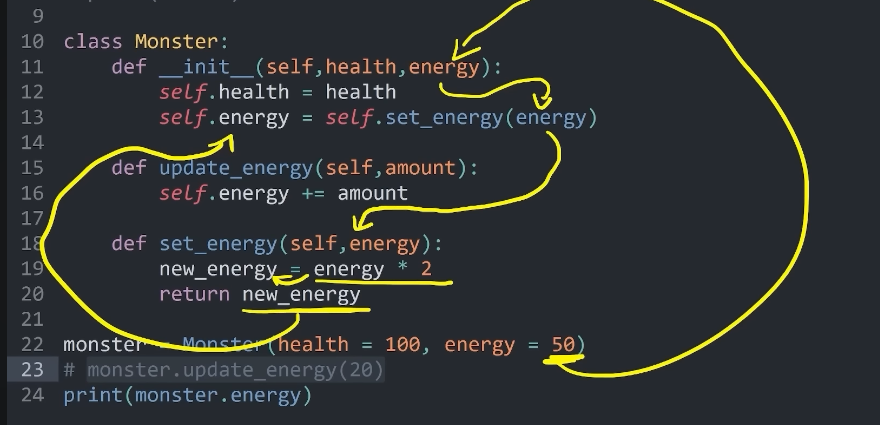
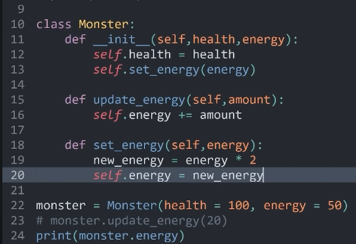

# Clases en python

### Definicion de una clase

Para la creacion de una clase basta con agrupar atributos y metodos en el cuerpo de un bloque `class` en python

Por ejemplo un dispositivo que tiene asociada una direccion de red (IP) que tiene esados apagado o encendido

``` 
class Dispositivo:                                           
 """clase dispositivo, para objetos conectados a la red"""      
   
   #metodo constructor para instanciar a la clase
   # siempre empieza por un metodo es decir una funcion
   
    def __init__(self,IP):
   # self representa la instancia actual de la clase
   # metodo constructor
        self.IP = IP # Atributo con valor definido
        self.encendido = False # Atributo con valor por defecto
    # metodo destructor 
    def __del__(self):
    """ Destructor """
        print("Destruyendo dispositivo en", self.IP)

    def encender(self):
    """ Enciende el dispositivo """
        self.encendido = True

    def apagar(self):
    """ Apaga el dispositivo """
        self.encendido = False

    def estado(self):
    """ Muestra en pantalla el estado del dispositivo """
        mensaje = f"IP: {self.IP}\n"
        if self.encendido:
            mensaje += 'Estado: encendido'
        else:
             mensaje += 'Estado: apagado'
        return mensaje
```

ejemplos de manera de utilizar el scope de los metodos en las clases


    
otra forma mas limpia de verlo

